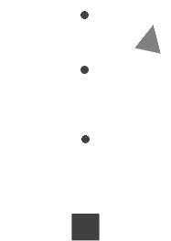
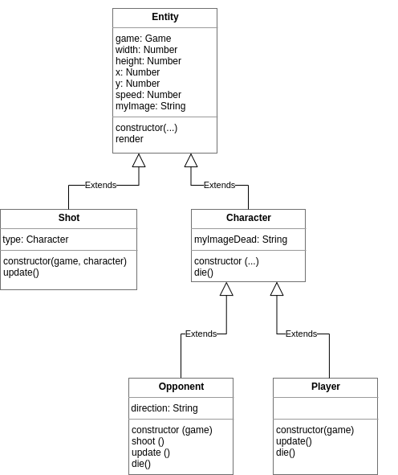

Link to the Glitch code: https://lava-hollow-triceratops.glitch.me/
Link to the live preview (site): [[https://your-project-name.glitch.me]](https://glitch.com/~lava-hollow-triceratops)
## Practice with Classes, Booleans, Strings, and Event Handling

In this assignment, we are going to develop a complete game using HTML, CSS, and JavaScript. The game is a classic shooting game where we control our character (a square) using the arrow keys or touch screen. The objective of the game is to shoot a series of shapes that will appear on the screen and turn them into stars, while dodging their shots. To start the development, we will use the basic version of the game, for which we provide the code.

## Game elements

The project should be downloaded or cloned onto the computer from which you are working. To do this, you can download the zip package with the code from the attached file.
In this code, we model each of the game elements using a JavaScript class with its methods and attributes, which are described below:

- Entity: Each of the elements drawn in the game
- Character: Each of the characters in the game, meaning those elements that have "life". Inherits from the ENTITY class.
- Player: The main character of the game. Inherits from the CHARACTER class.
- Opponent: The shape that we need to turn into a star. Inherits from the CHARACTER class.
- Shot: A shot from a CHARACTER. Inherits from the ENTITY class.
- Game: The game itself.

In the provided code, all the attributes and methods of these classes are documented in detail. The following diagram shows the class inheritance hierarchy:

## Game start and update

In the index.html file, all the necessary scripts for the game’s functionality are imported, including all the required classes and the main.js file. In this file, a series of constants necessary for the game are defined, an instance of the GAME class is created, and its START method is called to begin the game.

The START method creates the characters, draws the game according to the screen size, and initializes the event listeners (which we will see in the next section). Additionally, this method starts a timer that calls the UPDATE function every 50 ms to update and render the game's current state based on user actions, opponent movements, and the position of the shots. This time interval is equivalent to 20 frames per second, meaning we are updating the game 20 times per second—more than enough to create the illusion of movement.

## Event Handler

To control the main character of the game with the arrow keys or touch screen, we need to use the events provided by the browser for this purpose. In the START method of the GAME class, we initialize the necessary event listeners:

- keydown: Called when the user presses a key. Stores the pressed key in the KEYPRESSED attribute of GAME.
- keyup: Called when the user releases a key. Clears the content of the KEYPRESSED attribute of GAME.
- touchstart: Called when the user touches the screen. Stores the horizontal position (x) where the user touched in the XDOWN attribute of GAME.
- touchmove: Called when the user drags their finger across the screen. Clears the content of the XDOWN attribute of GAME.

As mentioned earlier, every 50 ms the UPDATE method of GAME is called. This method checks the value of XDOWN and KEYPRESSED to update the position of the main character based on the user's actions.

